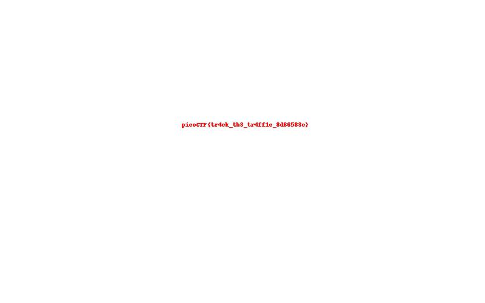

# Reverse engineering write up

## gatekeeper

* Input: A number greater than 999 and less than 9999
* Because of `atoi`(ascii to int) so we can enter a ascii string and it transfer to a number in ascii table
* Enter random input that when plus all ascii to int char greater than 999 to test and recive(I using string `abc` as input)
```
}847ftc_oc_ipd936ftc_oc_ipb_99ftc_oc_ip9_TGftc_oc_ip_xehftc_oc_ip_tigftc_oc_ipid_3ftc_oc_ip{FTCftc_oc_ipocipftc_oc_ip
```
From this output i can see that the string `ftc_oc_ip` looping so i just delete all the looping character and recieve the pure string

```shell
}847d936b_999_TG_xeh_tigid_3{FTCocip
```

* Reverse all the pure string and get the flag

```shell
}847   -> 748}
d936   -> 639d
b_99   -> 99_b
9_TG   -> GT_9
_xeh   -> hex_
_tig   -> git_
id_3   -> 3_di
{FTC   -> CTF{
ocip   -> pico
```

* Flag: `picoCTF{3_digit_hex_GT_999_b639d748}`

## hiddencipher 1

* When start execute the program, you will recived flag but encoded

* The encode flag is : `235a201d70201548251358110c552f135409`
* But i don't know how the encode flag printing so i use ida to decompiler the file `hidencipher`

* Thử XOR với đoạn text bên trên và được flag: `picoCTF{xor_unpack_4nalys1s_530ca742}`

## hidencipher 2

* First i connect to server and server give me a math problem(very easy to answer)
* Then you just answer the math problem and recieve the encoded flag

```c
int __fastcall encode_flag(__int64 a1, int a2)
{
  int i; // [rsp+1Ch] [rbp-4h]

  puts("Encoded flag values:");
  for ( i = 0; *(_BYTE *)(i + a1); ++i )
  {
    printf("%d", a2 * *(char *)(i + a1));
    if ( *(_BYTE *)(i + 1LL + a1) )
      printf(", ");
  }
  return putchar(10);
}
```
* Encode technique: using the number `a2` multiply with the character of the flag but you can guess it after recieve the encode flag

```python
Encodeflag = [
1680, 1575, 1485, 1665, 1005, 1260, 1050, 1845, 1635, 780, 1740, 1560, 1425, 1470, 765, 1560, 735, 1650, 1500, 1425, 1485, 735, 1680, 1560, 765, 1710, 1425, 780, 1455, 765, 1470, 750, 1485, 1485, 1530, 1875
]
```

* Try to divide the encoded flag to ascii number of every character with the prefix flag `picoCTF{` and its alway return 15

```txt
1680 / p (112) = 15

1575 / i (105) = 15

1485 / c (99) = 15

1665 / o (111) = 15

1005 / C (67) = 15

1260 / T (84) = 15

1050 / F (70) = 15

1845 / { (123) = 15
```
* Combine with the encode technique we discorvered we can see that the `a2` is 15 
* So what i need to do is divide all encoded number to 15 and then convert number to character according to the ascii table and recieve the flag

```python
data = [1680, 1575, 1485, 1665, 1005, 1260, 1050, 1845, 1635, 780, 1740, 1560, 1425, 1470, 765, 1560, 735, 1650, 1500, 1425, 1485, 735, 1680, 1560, 765, 1710, 1425, 780, 1455, 765, 1470, 750, 1485, 1485, 1530, 1875] # Replace your nums list here
text = ""
for num in data:
  char = num // 15 # Divide 15 to get the ascii number
  text += chr(char)
print(f"Flag is : {text}") # Flag
```

* flag : `picoCTF{m4th_b3h1nd_c1ph3r_4a3b2ccf}`

## The Add/On Trap

* First when i dowloaded the file it have suffix `.xpi` file so i change it to the suffix `.zip` file and compress it
* After compress the file, i recieve a folder and wwhen open that folder i see the `main.js`
* In this `main.js` files it have this encode string
```js
console.log(`Information to exfiltrate: ${details.url}`);
    const key="cGljb0NURnt5b3UncmUgb24gdGhlIHJpZ2h0IHRyYX0="
    const webhookUrl='gAAAAABmfRjwFKUB-X3GBBqaN1tZYcPg5oLJVJ5XQHFogEgcRSxSis1e4qwicAKohmjqaD-QG8DIN5ie3uijCVAe3xiYmoEHlxATWUP3DC97R00Cgkw4f3HZKsP5xHewOqVPH8ap9FbE'
    const payload = {
        content: `${details.url}`
        ...
    }
    ...
```

* The key is encoded by `base64` and the `webhookUrl` is `Fernet`
* SO i using python and decode the webbookurl by the Fernet in cryptographic lib, run this file and recieve the flag

```python
from cryptography.fernet import Fernet

# The 32-byte Base64 encoded key found in the extension
key = b"cGljb0NURnt5b3UncmUgb24gdGhlIHJpZ2h0IHRyYX0="

# The encrypted webhook URL
encrypted_webhook = b"gAAAAABmfRjwFKUB-X3GBBqaN1tZYcPg5oLJVJ5XQHFogEgcRSxSis1e4qwicAKohmjqaD-QG8DIN5ie3uijCVAe3xiYmoEHlxATWUP3DC97R00Cgkw4f3HZKsP5xHewOqVPH8ap9FbE"

# Initialize Fernet suite and decrypt
cipher = Fernet(key)
decrypted_url = cipher.decrypt(encrypted_webhook)

print(f"Decrypted Webhook: {decrypted_url.decode('utf-8')}")
```

flag : `picoCTF{Us3_4dd/0ns_v3ry_c4r3fully1}`

## Silent stream

* The challenge file have an pcap file `packet.pcap` and the `encrypt.py`
* First open the encrypt.py

```python
import socket

def encode_byte(b, key):

    return (b + key) % 256

def simulate_flag_transfer(filename, key=42):
    print(f"[!] flag transfer for '{filename}' using encoding key = {key}")

    with open(filename, "rb") as f:
        data = f.read()

    print(f"[+] Encoding and sending {len(data)} bytes...")

    for b in data:
        encoded = encode_byte(b, key)
        pass

    print("Transfer complete")

if __name__ == "__main__":
    simulate_flag_transfer("flag.txt") 

```
* The encode byte function is trying to create new byte by using the original byte `b` plus 42 and modulo with 256(the range of Ipv4 address) so what we need to decode is dump all raw byte from `packets.pcap` and decode all bytes
* But first lets open the packets file and see what happen

* All packet in this file using TCP protocol and port 9000 so i have to using python code to dump all byte from packet which using TCP protocol at port 9000 then append it into the bytearray with decode technique then write it into a file

```python
from scapy.all import *

packet = rdpcap("packets.pcap")
all_raw_data = bytearray()
for pkt in packet:
    if Raw in pkt and TCP in pkt and pkt[TCP].dport == 9000 :
        all_raw_data.extend(pkt[Raw].load)
h = bytearray()
for b in all_raw_data:
    h.append((b-42) % 256)
f = open("flag","wb")
f.write(h)
```
* Recive the file name flag and this is the JPEG image file and just rename file with .jpeg and i got the flag

Flag: `picoCTF{tr4ck_th3_tr4ff1c_8d66583c}`

## Secure Password Database

* When start running the program, i try to type random input but in check hash, when i type random input it terminate the program
* So the mission is, what is the check hash i need to type so lets load to IDA for answer
* In IDA, you can see a function name `make_secret` and this is the function to check hash
```c
__int64 __fastcall make_secret(__int64 a1)
{
  __int64 i; // [rsp+10h] [rbp-8h]

  for ( i = 0; obf_bytes[i]; ++i )
    *(_BYTE *)(a1 + i) = obf_bytes[i] ^ 0xAA;
  *(_BYTE *)(a1 + 12) = 0;
  return hash(a1);
}
```
* Using byte of obf_byte and dump it and we have hash byte then XOR with `0xAA` and then refact again the `hash` function

```python
data = bytearray()
hash_byte = [0xC3, 0xFF, 0xC8, 0xC2, 0x92, 0x9B, 0x8B, 0xC0, 0x80, 0xC2, 0xC4, 0x8B]
for i in range(len(hash_bytes)):
    data.append(hash_byte[i]^0xAA)
index = 5381
hash = ""
for i in range(len(data)):
    index=(33 * index + data[i])&0xFFFFFFFFFFFFFFFF
    hash+=index
print(f"Your hash: {hash}")
```
* When you have a hash now connect to the server and using random input and enter that hash value

Flag:`picoCTF{d0nt_trust_us3rs}`

## Auto Rev
